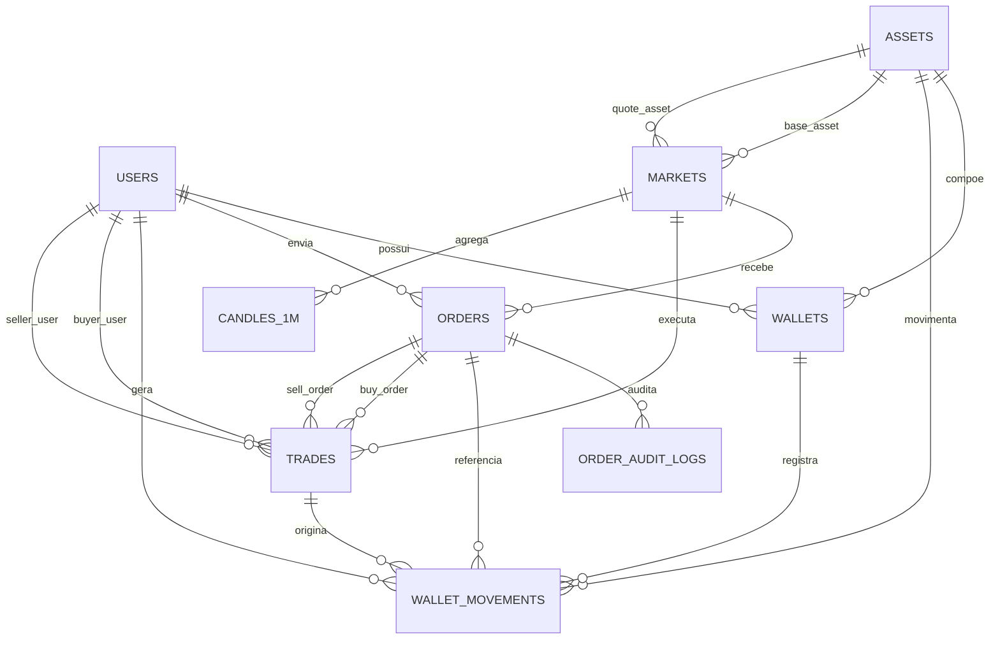

# Modelo Entidade-Relacionamento

Este DER representa o simulador de Order Book de criptomoedas. No Astah, o modelo pode ser desenhado como Class Diagram, usando classes como tabelas, atributos como colunas e associacoes com multiplicidade como relacionamentos.

## Entidades

### users

```text
+ user_id : BIGINT <<PK>>
+ name : TEXT
+ email : TEXT <<UK>>
+ status : user_status
+ created_at : TIMESTAMPTZ
```

### assets

```text
+ asset_id : BIGINT <<PK>>
+ symbol : TEXT <<UK>>
+ name : TEXT
+ precision : INTEGER
+ is_active : BOOLEAN
```

### markets

```text
+ market_id : BIGINT <<PK>>
+ base_asset_id : BIGINT <<FK>>
+ quote_asset_id : BIGINT <<FK>>
+ symbol : TEXT <<UK>>
+ price_precision : INTEGER
+ quantity_precision : INTEGER
+ is_active : BOOLEAN
```

### wallets

```text
+ wallet_id : BIGINT <<PK>>
+ user_id : BIGINT <<FK>>
+ asset_id : BIGINT <<FK>>
+ available_balance : NUMERIC(36,18)
+ locked_balance : NUMERIC(36,18)
+ updated_at : TIMESTAMPTZ
```

### orders

```text
+ order_id : BIGINT <<PK>>
+ user_id : BIGINT <<FK>>
+ market_id : BIGINT <<FK>>
+ side : order_side
+ price : NUMERIC(36,18)
+ original_quantity : NUMERIC(36,18)
+ remaining_quantity : NUMERIC(36,18)
+ executed_quantity : NUMERIC(36,18)
+ status : order_status
+ created_at : TIMESTAMPTZ
+ updated_at : TIMESTAMPTZ
+ cancelled_at : TIMESTAMPTZ
```

### trades

```text
+ trade_id : BIGINT <<PK>>
+ market_id : BIGINT <<FK>>
+ buy_order_id : BIGINT <<FK>>
+ sell_order_id : BIGINT <<FK>>
+ buyer_user_id : BIGINT <<FK>>
+ seller_user_id : BIGINT <<FK>>
+ price : NUMERIC(36,18)
+ quantity : NUMERIC(36,18)
+ quote_amount : NUMERIC(36,18)
+ executed_at : TIMESTAMPTZ
```

### order_audit_logs

```text
+ audit_id : BIGINT <<PK>>
+ order_id : BIGINT <<FK>>
+ old_status : order_status
+ new_status : order_status
+ old_remaining_quantity : NUMERIC(36,18)
+ new_remaining_quantity : NUMERIC(36,18)
+ reason : TEXT
+ created_at : TIMESTAMPTZ
```

### wallet_movements

```text
+ movement_id : BIGINT <<PK>>
+ wallet_id : BIGINT <<FK>>
+ user_id : BIGINT <<FK>>
+ asset_id : BIGINT <<FK>>
+ order_id : BIGINT <<FK>>
+ trade_id : BIGINT <<FK>>
+ movement_type : wallet_movement_type
+ amount : NUMERIC(36,18)
+ balance_available_after : NUMERIC(36,18)
+ balance_locked_after : NUMERIC(36,18)
+ created_at : TIMESTAMPTZ
```

### candles_1m

```text
+ market_id : BIGINT <<PK, FK>>
+ bucket_minute : TIMESTAMPTZ <<PK>>
+ open_price : NUMERIC(36,18)
+ high_price : NUMERIC(36,18)
+ low_price : NUMERIC(36,18)
+ close_price : NUMERIC(36,18)
+ volume_base : NUMERIC(36,18)
+ volume_quote : NUMERIC(36,18)
+ trades_count : BIGINT
```

## Relacionamentos

```text
users 1 -- 0..* wallets
users 1 -- 0..* orders
users 1 -- 0..* wallet_movements
users 1 -- 0..* trades : buyer_user
users 1 -- 0..* trades : seller_user

assets 1 -- 0..* wallets
assets 1 -- 0..* wallet_movements
assets 1 -- 0..* markets : base_asset
assets 1 -- 0..* markets : quote_asset

markets 1 -- 0..* orders
markets 1 -- 0..* trades
markets 1 -- 0..* candles_1m

orders 1 -- 0..* order_audit_logs
orders 1 -- 0..* wallet_movements
orders 1 -- 0..* trades : buy_order
orders 1 -- 0..* trades : sell_order

wallets 1 -- 0..* wallet_movements
trades 1 -- 0..* wallet_movements
```

## Mermaid


